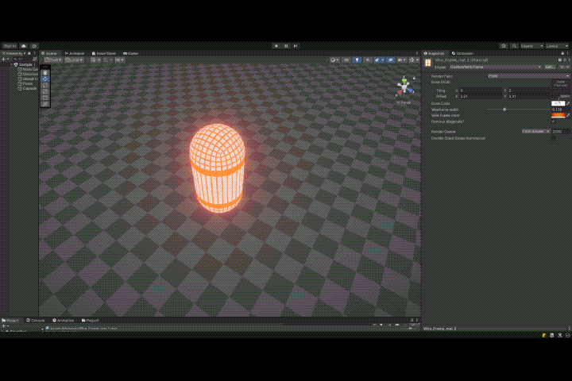

Wireframe Shader for Unity

Overview
The Wireframe Shader is a powerful and versatile shader for Unity, designed to render objects with a dynamic wireframe overlay. It's perfect for developers who need to debug models, visualize geometry, or create stylized visual effects. The shader is highly customizable, supporting HDR colors and is compatible with the Universal Render Pipeline (URP).

Features
Customizable Wireframe Width: Easily adjust the width of the wireframe lines to fit your project’s needs.
Flexible Wireframe Color: Choose any HDR color for the wireframe to match your project's aesthetic.
Edge Detection: Automatically highlights edges of the geometry, with an option to remove diagonal edges for cleaner visuals.
Texture Tiling and Offset Support: Properly handles texture tiling and offset, ensuring your textures look correct on the wireframe.
Installation
Download the Package: Clone or download the repository from GitHub.
Import into Unity: Drag and drop the .unitypackage file into your Unity project, or directly import the shader files into your Assets folder.
Usage
Apply the Shader: Select the material you want to use and apply the Wireframe Shader from the Shader dropdown in the Inspector.
Customize Settings: Use the Material Inspector to adjust wireframe width, color, and other properties according to your needs.
Enable/Disable Features: Toggle the option to remove diagonal edges for a cleaner wireframe look.

Compatibility
Unity Versions: 2020 and above
Render Pipeline: Universal Render Pipeline (URP)
Platform: Compatible with all platforms supported by Unity
License
This shader is available under the MIT License. Feel free to use it in both personal and commercial projects. No attribution is required, but contributions are welcome!

Contributing
Contributions to improve the shader are welcome! Feel free to submit a pull request or report issues in the Issues section.

Contact
For any questions or support, you can reach out via email or open an issue on GitHub.
