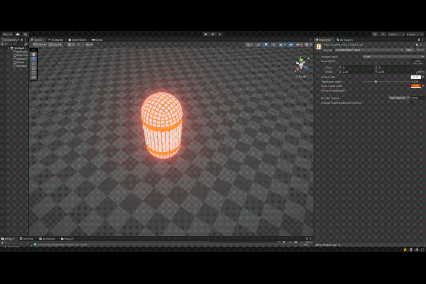

🎮 Wireframe Shader for Unity (URP)

  

A highly customizable and performance-friendly wireframe shader built for Unity's Universal Render Pipeline (URP). Whether you're aiming for a stylized visual effect, geometry visualization, or debugging 3D models, this shader gives you full control over how wireframes appear in your project.

✨ Features
🎚️ Adjustable Wireframe Width
Seamlessly tweak the thickness of the wireframe lines to suit your artistic or technical needs.

🎨 HDR Wireframe Colors
Full support for HDR colors allows vibrant, glowing, or stylized effects.

🧠 Smart Edge Detection
Automatically detects mesh edges. Optionally remove diagonal edges for a cleaner, more readable wireframe.

🧵 Texture Tiling & Offset Support
Preserves texture behavior — wireframes align correctly even with custom tiling and offsets.

📦 Installation
Clone or Download this repository.

🚀 Getting Started
Apply the Shader
Select your material, then assign the Wireframe Shader via the Shader dropdown in the Inspector.

Customize Your Look
Modify the wireframe width, color, edge settings, and texture properties via the Material Inspector.

Toggle Edge Options
Use the built-in toggle to disable diagonal edges for a technical, non-overlapping wireframe effect.

✅ Compatibility
Unity Versions: 2020.3+

Render Pipeline: Universal Render Pipeline (URP)

Platforms: Fully cross-platform (PC, Mac, iOS, Android, WebGL, etc.)

📄 License
This project is released under the MIT License.
✅ Free to use in personal, academic, or commercial projects — no attribution required.
🤝 Contributions and improvements are always welcome!

📬 Contact
For questions, feature requests, or support:
Open an issue on GitHub or reach out via email.

⭐ If you find this useful, consider giving the repository a star! It helps more developers discover the project.
